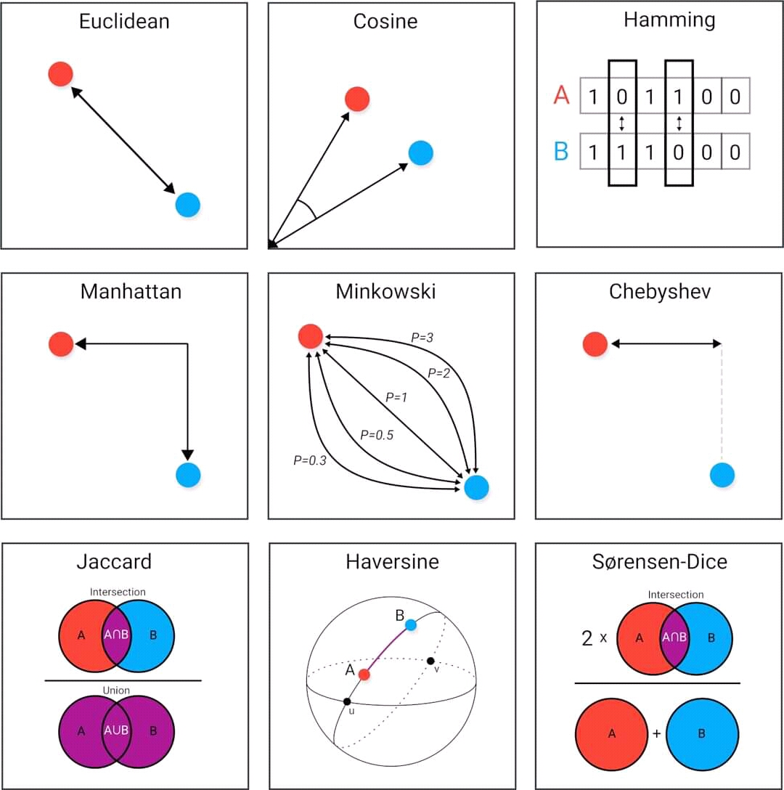
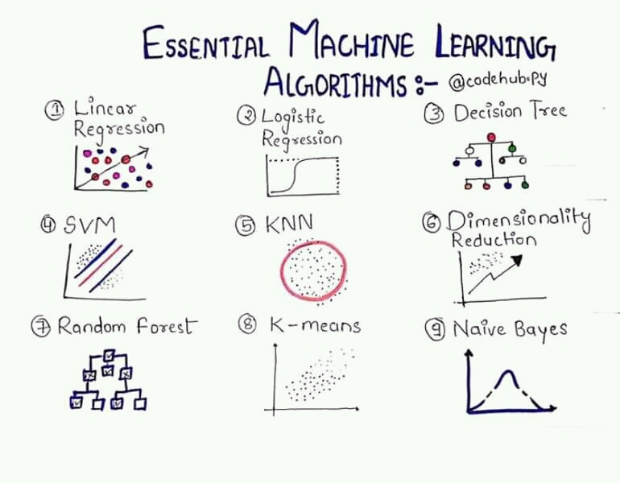

# Curso de Paradigmas y programación para ciencia de datos, IIMAS-UNAM
Este repositorio contiene notas,practicas, tareas y proyectos del curso de Paradigmas y programación para ciencia de datos impartido en la Licenciatura en Ciencia de Datos en el IIMAS.

Conceptos básicos de reducción de datos, extracción de información y análisis
predictivo que permiten obtener conocimiento para predecir tendencias y patrones de
comportamiento.

<!---->

---

## Temario
|Introducción a ciencia de datos|
|---|
|Reducción de datos|
|Mapeo de datos y construcción de diccionarios|
|Algoritmos escalables y estadística asociativa|
|Introducción Hadoop, MapReduce y procesos por lotes|
|Extracción de grandes cantidades de información, uso de disco vs. uso de memoria|
|Visualización|
|Métodos de regresión lineal|
|Análisis de agrupamiento     |
|Análisis predictivo|
|Funciones de predicción: k-vecinos|
|Funciones de predicción: clasificador bayesiano multinomial|

|Programación en lenguaje para ciencia de datos  Python|
|---|
|Tipos de datos y operadores básicos|
|Operaciones con cadenas de caracteres|
|Estructuras de control|
|Listas, tuplas y diccionarios|
|Arreglos multidimensionales|
|Tablas|
|Series de tiempo|
|Archivos|
|Funciones|
|Clases|
|Visualización de datos|
|Bibliotecas estadísticas|

|Programación en R o similar|
|---|
|Tipos de datos y operadores básicos|
|Operaciones con cadenas de caracteres|
|Estructuras de control|
|Vectores, matrices, arreglos multidimensionales|
|Factores, listas, tuplas y diccionarios|
|Tablas|
|Series de tiempo|
|Archivos|
|Funciones|

---
## Profesor
**Eduardo Espinosa**
  
---
## Recursos electrónicos

1. Jake VanderPlas, Python Data Science Handbook.[Liga](https://jakevdp.github.io/PythonDataScienceHandbook/index.html) 
1. Sitio web .[Liga](http://dicyg.fi-c.unam.mx:8080/lalo)    
1. Practical python [Liga](https://practical.learnpython.dev/)

## Ambientes de programación
En este curso las herramientas de programación que se emplearán son las siguientes:
- [Google Colab](https://colab.research.google.com/)
- [Deepnote](https://deepnote.com/)
- [Kaggle](https://www.kaggle.com/)

