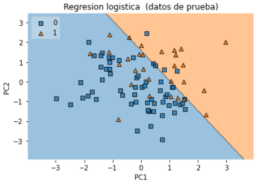

# Curso de Paradigmas y programación para ciencia de datos, IIMAS-UNAM
Este repositorio contiene notas,practicas, tareas y proyectos del curso de Paradigmas y programación para ciencia de datos impartido en la Licenciatura en Ciencia de Datos en el IIMAS.

Conceptos básicos de reducción de datos, extracción de información y análisis
predictivo que permiten obtener conocimiento para predecir tendencias y patrones de
comportamiento.

---
## [Tareas](https://github.com/gandres-dev/Paradigmas-para-ciencia-datos/tree/main/Tareas)
- [Programa 1 - Cifrado1](https://nbviewer.org/github/gandres-dev/Paradigmas-para-ciencia-datos/tree/main/Tareas/Programa1-Cifrado1/Programa1_pypcd.ipynb)
- [Programa 2 - Cifrado2](https://nbviewer.org/github/gandres-dev/Paradigmas-para-ciencia-datos/tree/main/Tareas/Programa2-Cifrado2/Programa2_pypcd.ipynb)
- [Programa 3 - SBS-Covarianzas](https://nbviewer.org/github/gandres-dev/Paradigmas-para-ciencia-datos/tree/main/Tareas/Programa3-SBS-Covarianzas/Programa3_pypcd.ipynb)
- [Programa 4 - RegresionLineal](https://nbviewer.org/github/gandres-dev/Paradigmas-para-ciencia-datos/tree/main/Tareas/Programa4-RegresionLineal/Programa4_pypcd.ipynb)
- [Programa 5 - AgrupamientoJerarquico](https://nbviewer.org/github/gandres-dev/Paradigmas-para-ciencia-datos/tree/main/Tareas/Programa5-AgrupamientoJerarquico/Programa5_pypcd.ipynb)
- [Programa 6 - K Medias](https://nbviewer.org/github/gandres-dev/Paradigmas-para-ciencia-datos/tree/main/Tareas/Programa6-Kmedias/Programa6_pypcd.ipynb)
- [Programa 7 - K Vecinos](https://nbviewer.org/github/gandres-dev/Paradigmas-para-ciencia-datos/tree/main/Tareas/Programa7-Vecinos/Programa7.ipynb)
- [Programa 8 - ClasificadorBayesiano](https://nbviewer.org/github/gandres-dev/Paradigmas-para-ciencia-datos/tree/main/Tareas/Programa8-ClasificadorBayesiano/Programa8.ipynb)
- [Programa 9 - SeriesTiempo](https://nbviewer.org/github/gandres-dev/Paradigmas-para-ciencia-datos/tree/main/Tareas/Programa1-Cifrado1/Programa8_pypcd.ipynb)

<!---->
<!--  -->

---
## [Proyecto (Detector para insuficiencia cardíaca)](https://nbviewer.org/github/gandres-dev/Paradigmas-para-ciencia-datos/tree/main/Proyecto/proyecto_insuficiencia_cardiaca.ipynb)
La insuficiencia cardíaca es una enfermedad progresiva crónica en la que el músculo cardíaco no puede bombear suficiente sangre para satisfacer las necesidades de sangre y oxígeno del cuerpo.

---
## Profesor
**Eduardo Espinosa**
  
---
## Recursos electrónicos

1. Jake VanderPlas, Python Data Science Handbook.[Liga](https://jakevdp.github.io/PythonDataScienceHandbook/index.html) 
1. Sitio web .[Liga](http://dicyg.fi-c.unam.mx:8080/lalo)    
1. Practical python [Liga](https://practical.learnpython.dev/)

## Ambientes de programación
En este curso las herramientas de programación que se emplearán son las siguientes:
- [Google Colab](https://colab.research.google.com/)
- [Deepnote](https://deepnote.com/)
- [Kaggle](https://www.kaggle.com/)

